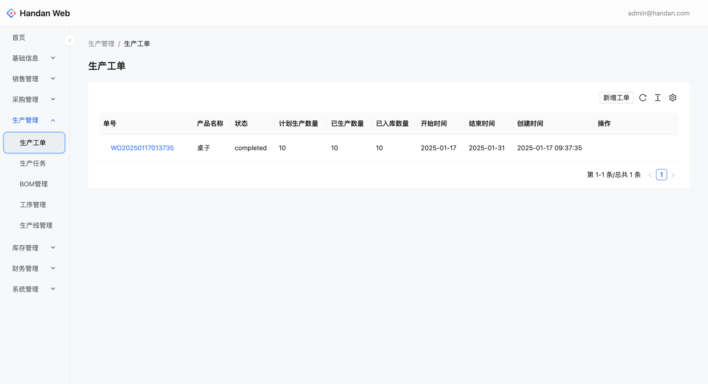

# Handan Web

> 中小企业的开源 ERP (MES) 前端解决方案 - Nianxiaoyou 的开源版本

[English](./README.EN.md) | 简体中文

<div align="center">
	
</div>

<div align="center">
	<a href="https://handan-web.vercel.app">在线演示</a>
</div>

## 📖 项目简介

Handan Web 是 [年小友](https://www.nianxiaoyou.com) 的开源版本，专为中小型制造企业打造的轻量级、易用的数字化管理前端系统。

我们深知中小企业在数字化转型中面临的挑战：市面上的 ERP 系统要么功能过于复杂，学习成本高；要么价格昂贵，难以承受。Handan 致力于提供一个**简洁、实用、开源**的解决方案，帮助企业以最低的成本实现业务流程的数字化管理。

### 核心特性

- ✅ **轻量级架构**：基于 Next.js + GraphQL，快速响应，易于部署
- ✅ **现代化 UI**：采用 Ant Design 设计系统，提供优秀的用户体验
- ✅ **模块化设计**：各业务模块独立，易于扩展和维护
- ✅ **开源免费**：MIT 许可证，完全开源，持续更新
- ✅ **GraphQL API**：高效的数据查询，减少网络请求
- ✅ **TypeScript**：类型安全，提升开发效率和代码质量

## 🚀 功能模块

### 已实现功能

#### 1. 销售管理
- ✅ 销售订单管理（创建、查看、编辑）
- ✅ 客户管理（客户档案、联系信息）
- ✅ 销售统计（基础统计报表）

#### 2. 采购管理
- ✅ 采购订单管理（创建、查看、编辑）
- ✅ 供应商管理（供应商档案、联系信息）
- ✅ 采购统计（基础统计报表）

#### 3. 生产管理（MES）
- ✅ 生产工单管理（工单创建、调度）
- ✅ 生产任务管理（任务分配、进度跟踪）
- ✅ BOM 管理（物料清单）
- ✅ 生产工序管理（工序定义）
- ✅ 生产班组管理（班组配置）

#### 4. 库存管理
- ✅ 出库记录（出库单查看）
- ✅ 入库记录（入库单查看）
- ✅ 库存记录（库存流水查询）

#### 5. 财务管理
- ✅ 销售收款凭证
- ✅ 采购付款凭证
- ✅ 交易记录查询
- ✅ 支付方式管理

#### 6. 产品管理
- ✅ 产品档案（产品增删改查）
- ✅ 计量单位管理
- ✅ 仓库管理（仓库配置）

#### 7. 系统设置
- ✅ 成员管理（用户权限）

### 规划中的功能（Nianxiaoyou 已有）

以下是 Nianxiaoyou 中已实现，但 Handan Web 尚未完成的功能：

#### 销售管理增强
- [ ] 销售看板（销售业绩、客户状况可视化）
- [ ] 报价单管理
- [ ] 销售产品记录（产品维度分析）
- [ ] 销售出库管理（与库存联动）
- [ ] 应收账款管理（收款记录、对账）

#### 采购管理增强
- [ ] 采购看板（采购成本、供应商状况可视化）
- [ ] 采购产品记录（产品维度分析）
- [ ] 采购入库管理（与库存联动）
- [ ] 应付账款管理（付款记录、对账）

#### 生产管理增强
- [ ] 简易生产工单（轻量级生产管理）
- [ ] 生产报工（生产进度记录）
- [ ] 成品入库（生产完工入库）
- [ ] 报工记录（历史报工查询）

#### 委外管理（新模块）
- [ ] 委外订单管理
- [ ] 委外供应商管理
- [ ] 委外物料管理

#### 库存管理增强
- [ ] 库存信息（实时库存查询）
- [ ] 库存调拨（仓库间转移）
- [ ] 库存盘点（盘点流程）

#### 财务管理增强
- [ ] 应收账款管理（独立模块）
- [ ] 应付账款管理（独立模块）
- [ ] 委外支付管理
- [ ] 其他收付款（预收预付款等）

#### 产品管理增强
- [ ] 批量调价（价格调整单）
- [ ] 产品分组（分类管理）
- [ ] 品牌管理

#### 系统设置增强
- [ ] 团队信息（企业配置、打印模板）

## 🛠 技术栈

### 前端框架
- **Next.js** - React 服务端渲染框架
- **React 18** - 用户界面构建库
- **TypeScript** - 类型安全的 JavaScript 超集

### UI 组件库
- **Ant Design** - 企业级 UI 设计语言和 React 组件库
- **Ant Design Pro Components** - 高级业务组件库
- **Tailwind CSS** - 实用优先的 CSS 框架

### 数据管理
- **Apollo Client** - GraphQL 客户端，用于数据获取和状态管理
- **Zustand** - 轻量级 React 状态管理库
- **GraphQL** - 高效的 API 查询语言

## 🚀 快速开始

### 环境要求

- Node.js >= 16.x
- pnpm >= 8.x

### 安装依赖

```bash
pnpm install
```

### 配置后端服务

在 `src/gql/apollo/index.ts` 中配置 GraphQL API 地址：

```typescript
const httpLink = createHttpLink({
  uri: 'http://localhost:4000/api', // 后端 GraphQL 地址
});
```

### 开发环境运行

```bash
pnpm run dev
```

在浏览器中打开 [http://localhost:3000](http://localhost:3000) 查看应用。

### 构建生产版本

```bash
pnpm run build
```

### 启动生产环境

```bash
pnpm run start
```

## 📁 项目结构

```
handan_web/
├── src/
│   ├── components/            # React 组件
│   │   ├── common/           # 通用组件（布局、菜单等）
│   │   ├── sales-order/      # 销售订单组件
│   │   ├── purchase-order/   # 采购订单组件
│   │   ├── work-order/       # 生产工单组件
│   │   ├── customer/         # 客户管理组件
│   │   ├── supplier/         # 供应商管理组件
│   │   ├── item/             # 产品管理组件
│   │   └── ...               # 其他业务组件
│   ├── pages/                # Next.js 页面路由
│   ├── gql/                  # GraphQL 相关
│   │   ├── apollo/           # Apollo Client 配置
│   │   └── documents/        # GraphQL 查询和变更
│   ├── stores/               # Zustand 状态管理
│   ├── utils/                # 工具函数
│   └── styles/               # 全局样式
├── public/                   # 静态资源
└── ...                       # 配置文件
```

## 🔗 相关项目

- **后端项目**: [Handan](https://github.com/nianxiaoyou/handan) - Elixir + Phoenix + GraphQL + CQRS/ES
- **企业版**: [Nianxiaoyou](https://www.nianxiaoyou.com) - 功能更完整的企业版本

## 🤝 贡献指南

欢迎贡献代码！我们期待您的参与，一起打造更好的开源 ERP 系统。

### 贡献流程

1. Fork 本仓库
2. 创建特性分支 (`git checkout -b my-new-feature`)
3. 提交您的修改 (`git commit -am 'Add some feature'`)
4. 推送到分支 (`git push origin my-new-feature`)
5. 创建 Pull Request

### 开发规范

- 遵循 TypeScript 类型约束
- 保持代码风格一致
- 为新功能添加适当的注释
- 确保代码可以正常构建

## 📄 许可证

Handan Web 采用 [MIT License](http://opensource.org/licenses/MIT) 开源协议。

## 📞 联系方式

- GitHub Issues: [提交问题](https://github.com/zven21/handan_web/issues)
- 项目主页: [GitHub](https://github.com/zven21/handan)

---

**注**: 作为开源项目，Handan 会持续更新迭代，不断完善功能，修复问题。我们欢迎社区贡献，一起打造更好的开源 ERP 系统。
